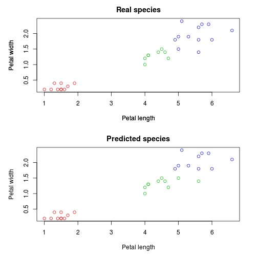

Random Forest
========================================================
author: Denis Kuzminykh

Developing Data Products Course Project presentation

Random forest algorithm
========================================================

Random forests are an ensemble learning method for classification, regression and other tasks, that operate by constructing a multitude of decision trees at training time and outputting the class that is the mode of the classes (classification) or mean prediction (regression) of the individual trees. Random forests correct for decision trees' habit of overfitting to their training set.  
[Wikipedia](https://en.wikipedia.org/wiki/Random_forest)

Random forest example
========================================================


```r
set.seed(1)
library(randomForest)
data(iris)
inTrain <- sample(1:nrow(iris), nrow(iris)*0.8)
trainingData <- iris[inTrain,]
testData <- iris[-inTrain,]
rf <- randomForest(data=trainingData, 
                   Species ~ .)
predicted <- predict(rf, testData)
```

Random forest example, results:
========================================================

 

The app
========================================================

I have deployed an app where you can try random forest on more complex example: 'spam' dataset from 'kernlab' package. You can see how performance depends on number of trees and maximum number of nodes in trees.

Sidebar panel allows to choose the parameters, while main panel shows confusion matrix and some performance metrics.

It is available on [shinyapps.io](https://crimsonlander.shinyapps.io/coursera_dev_data_products_proj)
